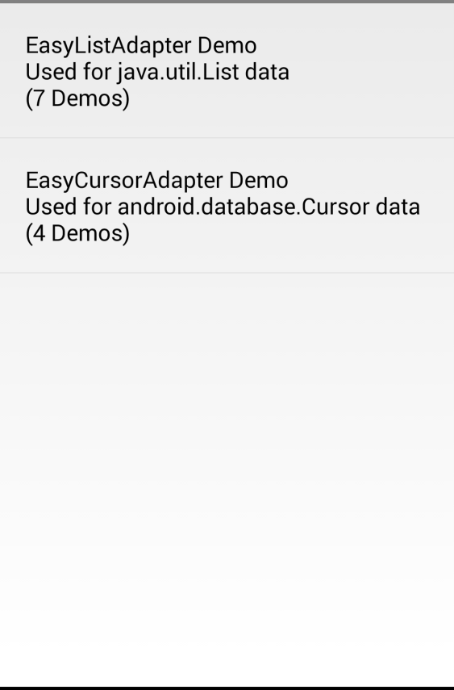
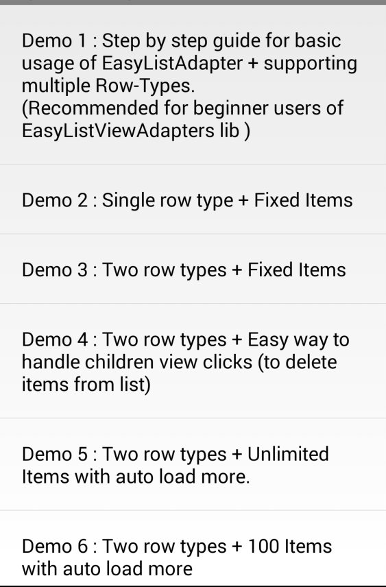
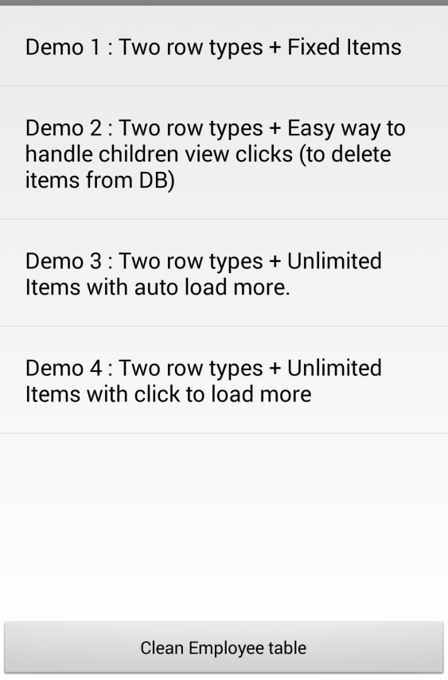
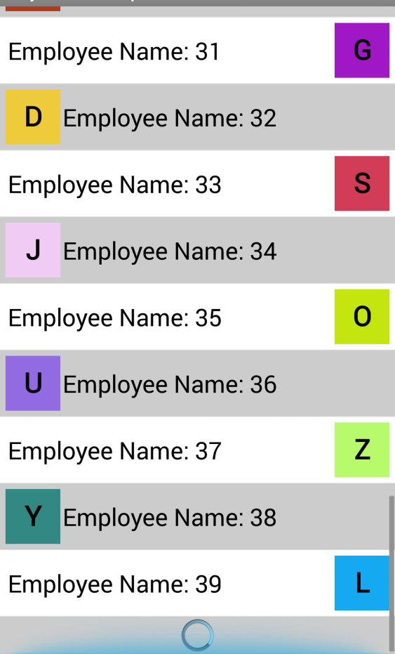

EasyListViewAdapters
====================

Whenever you want to display custom items in listview, then only way to achieve this is to implement your own subclass of BaseAdapter, handle all rendering, recycling, click handling ,data browsing youself in getView() method. It becomes very messy as number of rows increase in your adapter, Making your code very messy & non-reusable. This library allows you to make Modular classes which will help you to introduce new row type easily.

This library is designed on [ViewHolder] (http://developer.android.com/training/improving-layouts/smooth-scrolling.html#ViewHolder) design pattern, it provides an easier way of linking multiple type rows and their underlying data. The EasyAdapters will do most of tedious work for you & all you have to do is create your small modular classes & link them together. 

<table align= 'center'>
<tr>
<td> </td>
<td> </td>
</tr>
</table>

Features
========

* **Easier** than implementing your own Adapter (ie handling BaseAdaper#getView).Very Easier to provide multi-row support.
* Library takes care of recycling all views, that **ensures performance** & helps your list view scroll smoothly.
* **Cleaner code**. By keeping different RowViewSetter classes for different row-types makes your code easy to manage & easy to reuse.
* **No data browsing**, Library takes care of browsing data through data-structure when View is being drawn or event occurs so that Users does not have to look for their data to take actions.
* Just by passing correct row-types library will **Auto-map** your data-types to row-types to render views.
* Row views can be created by using **XML or Java** (doesn't restrict to XML-Only Approach).
* Load More callbacks can be registered to implement **paginatation support** to your list.
* **Handling children viewclicks**, you can also register for Children(present inside your rows) view click events. All these Views are registered with single OnClickListner so that this mechanism is very **memory efficient** when click event occurs users you gets clickedChildView, rowData,int eventId as callback params.

Compatibility
=========
* **Library** : API 4+(DONUT)
* **LibrarySample** : API 11+(HONEYCOMB)

Supported Data-types
====================
* **EasyListAdapter** : works with java.util.List of data.
* **EasyCursorAdapter** : works with android.database.Cursor

**Note** : **EasyCursorAdapter** doesn't provide any mechanism to requery attached Cursor (Like traditional CursorAdapter), This behaviour is intentionally omitted as it has been deprecated from Android Sources as well.Instead use [CursorLoader Mechanism](https://developer.android.com/training/load-data-background/setup-loader.html).

Debugging 
=========

See the **[Debugging Exceptions](/Extras/Documentations/debugging_exceptions.md)** to know about all Exceptions thrown by library & how to fix them.

License
=======
   Copyright 2014-present Biraj Patel

   Licensed under the Apache License, Version 2.0 (the "License");
   you may not use this file except in compliance with the License.
   You may obtain a copy of the License at

       http://www.apache.org/licenses/LICENSE-2.0

   Unless required by applicable law or agreed to in writing, software
   distributed under the License is distributed on an "AS IS" BASIS,
   WITHOUT WARRANTIES OR CONDITIONS OF ANY KIND, either express or implied.
   See the License for the specific language governing permissions and
   limitations under the License.

